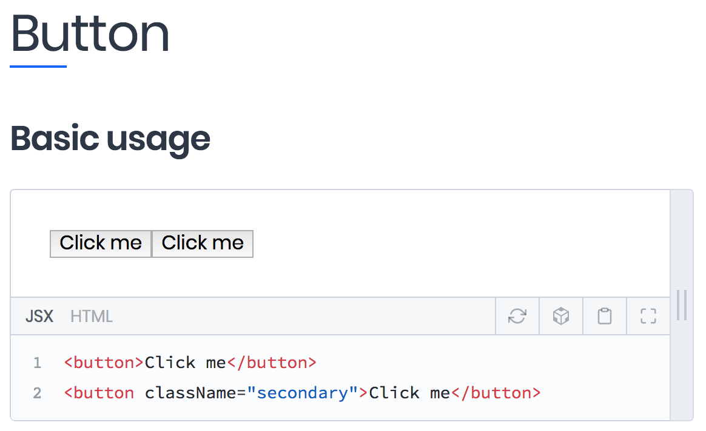

## Contributing to Astro

It's awesome that you want to contribute to Astro! Before proceeding, please read our [Code of Conduct](CODE_OF_CONDUCT.md).

Our design system and components are documented with [Docz](https://www.docz.site/) and hosted by [GitHub Pages](https://pages.github.com/). Its documentation can be viewed at [magnetis.github.io/astro](https://magnetis.github.io/astro/).

We recommend [Prettier](https://github.com/prettier/prettier) as your code formatter to keep a consistent style.

## Table of contents

- [Setup and running](#setup-and-running)
- [Updating the documentation](#updating-the-documentation)
- [Staging the documentation](#staging-the-documentation)
- [Publishing your changes to Astro online docs](#publishing-your-changes-to-astro-online-docs)
- [Troubleshooting](#troubleshooting)

### Setup and running

Please follow these steps to run the project and start coding:

1. Clone Astro if you haven't by running `git clone https://github.com/magnetis/astro.git` on your terminal. This will download the whole project into your machine.

2. If you previously cloned Astro, run `git pull` to get the latest update from the remote repository. Always do this when you come back to the project.

3. For the next step, you need to install the dependencies on your machine. Still on your terminal, run `yarn install`.

4. Create a new branch to work on, with the command `git checkout -b yourbranch` (replace "yourbranch" with your branch name).

5. You're now ready to run Docz with the Astro documentation on your local server. Run `yarn docz:dev` and visit [localhost:3000](http://localhost:3000/).

6. Find the file(s) you wish to edit in the folders below:

   - Design system base CSS files: `src/css` folder - if you create a new file here, please add the import to `src/index.css`.

   - Import fonts to Docz: `public/docz.html`. If you make any changes to this file, you'll only be able to view them if you stop your local server (hit "control + C" on your terminal) and run it again (step 4).

   - Docz documentation pages including components: `docs` folder.

7. You can view your changes by refreshing the page at [localhost:3000](http://localhost:3000/) (it refreshes automatically as you save files on your editor, though).

After you're done, [open a pull request](https://help.github.com/articles/creating-a-pull-request/) and grab some coffee while we review your code.

### Updating the documentation

Every time you create or edit a component, edit CSS base files or contribute to anything Astro-wise, you'll most likely have to update our docs to reflect these changes. Here's how to work on them!

Docz uses [MDX](https://github.com/mdx-js/specification) as a format, which means you can write JSX inside Markdown files. See an example file below:

```jsx
---
name: Button
---

import { Playground } from 'docz'
import { Button } from './Button'

# Button

## Basic usage

<Playground>
  <Button>Click me</Button>
  <Button className="secondary">Click me</Button>
</Playground>
```

The top of the file displays the page name and, below that, the imports. That's where React components can be imported into documentation pages, like the `Button` component in the example above.

The `<Playground>` component is how you can render your component _and_ show its code in a single view. See how the above example looks like when it's rendered:



Inside `<Playground>`, you can add new components, edit their attributes or their inner content.

Everything else in that example is Markdown. That's where titles and descriptions go, which can also be edited.

Wanna dive deeper into Docz? You can [read their tutorial](https://www.docz.site/introduction/getting-started).

### Staging the documentation

There isn't a staging environment because GitHub Pages only works on one branch per repository. We recommend using [Localtunnel](https://localtunnel.github.io/www/) to generate a public URL that makes your locally running server accessible by anyone. It's a super simple, two-step process to which you'll find instructions on their website.

### Publishing your changes to Astro online docs

We **don't** update the online docs everytime there's a new merge to master. You should only do this if you're creating a new release. No spoilers! ;)

Here's how to deploy to GitHub Pages:

In your terminal, after merging: checkout to master, do `git pull` and run `yarn docs:publish` to deploy.

Visit [magnetis.github.io/astro](https://magnetis.github.io/astro/) and make sure your changes go live! 🎉 While you're there, please check if everything still looks okay.

## Troubleshooting

- `error: RPC failed; curl 56 LibreSSL SSL_read: SSL_ERROR_SYSCALL, errno 60` when deploying to GitHub Pages

  Might be a slow connection issue - try resetting your wifi. Yeah, really.

Found a bug? Please see if it was already reported on our [issues page](https://github.com/magnetis/astro/issues). If you can't find a matching report, you can [open a new issue](https://github.com/magnetis/astro/issues/new) including as much information as you can gather. We appreciate it!

Any lingering questions? You can contact us at [dev@magnetis.com.br](mailto:dev@magnetis.com.br).

Thank you for contributing! 🎉
